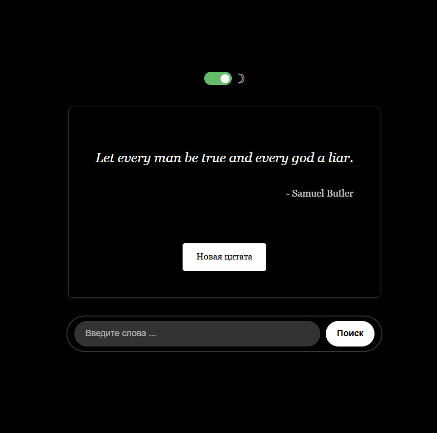
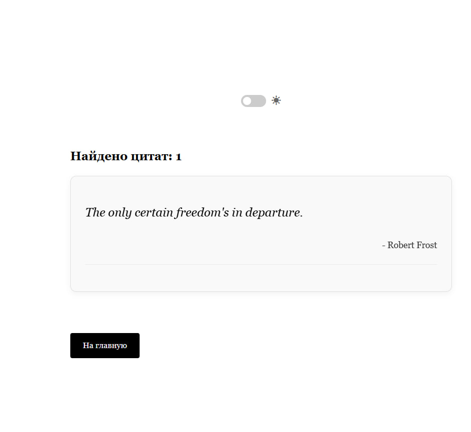
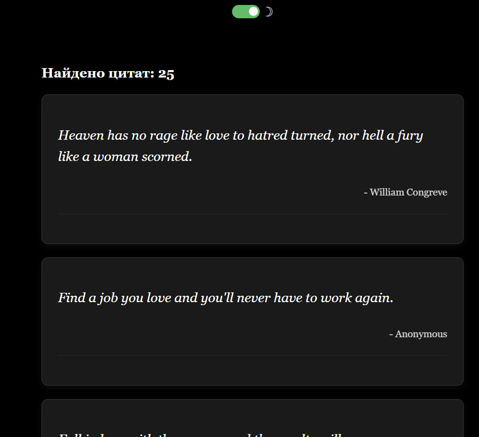

# Генератор Случайных Цитат
Небольшое веб-приложение на Spring Boot, которое показывает случайные мотивационные цитаты и позволяет искать их по ключевым словам.

### Что получилось:
#### Главная страница с красивым интерфейсом (светлая/тёмная тема) и случайной цитатой

 #### Поиск цитат по ключевым словам

Технологии: Java 23, Spring Boot, Thymeleaf, REST API, Maven.